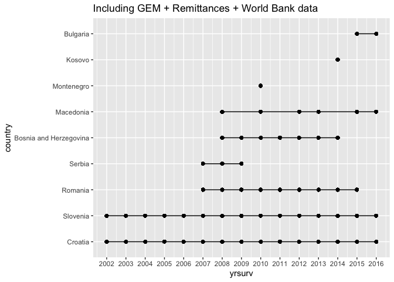
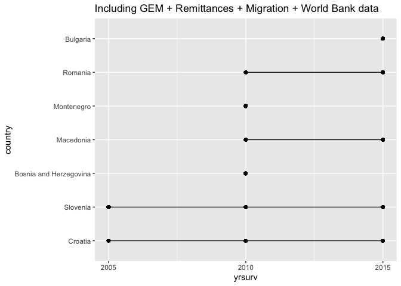

Dataset descriptions and transformation process from raw to tidy
================
Jonathan
8/1/2020

# Dataset descriptions

In this folder you can find:

  - ***balkans\_gem\_02\_16.csv***: which includes the 21 variables only
    for the Balkans for the years 2002 to 2016. Saved as .csv to share
    it.
  - ***balkans\_gem\_rem\_wb\_02\_16.csv***: which includes 40 variables
    (21 from GEM + 2 from Remittances + 17 from World Bank of Balkans
    for 2002 to 2016). Saved as .csv.
  - ***balkans\_gem\_rem\_mig\_wb\_05\_15.csv***: which includes the 42
    variables (21 from GEM + 2 from Remittances + 2 from Migrarion + 17
    from World Bank of Balkans for 2005, 2010 and 2015).
  - ***balkans\_codebook.csv***: includes the variable names, labels,
    descriptions, categories and other details necessary to understand
    the data in *“balkans\_gem\_02\_16.csv”*.
  - ***gem\_vars\_metadata.csv***: includes all the variables used in
    GEM reports and datasets. Their names, labels, descriptions,
    categories and other details necessary to understand the entire GEM
    data in case we could need other variable apart from the
used.

-----

#### You can find the codebook [here](https://github.com/jonaperezl/Diaspora-EE-NIS/blob/master/data_tidy/balkans_codebook.csv).

-----

# Description of the data transformation process

## Data processing log of **GEM data** from raw to tidy

### Tidy datasets created as output of this process and stored in `data_tidy` folder:

  - **gem\_21vars\_01\_16.RData**: which includes the 21 variables of
    interest for all the countries in years 2001 to 2016. Saved as
    .RData to optimize space and because we don’t need to share this
    file or work on it.
  - **balkans\_gem\_02\_16.csv**: which includes the 21 variables only
    for the Balkans for the years 2001 to 2016. Saved as .csv to share
    it.
  - **gem\_balkans\_codebook.csv**: includes the variable names, labels,
    descriptions, categories and other details necessary to understand
    the data in *“balkans\_gem\_02\_16.csv”*.
  - **gem\_vars\_metadata.csv**: includes all the variables used in GEM
    reports and datasets. Their names, labels, descriptions, categories
    and other details necessary to understand the entire GEM data in
    case we could need other variable apart from the 21 used.

### Raw GEM datasets

The GEM APS Individual Level datasets from each year were downloaded
from the [GEM Consortium
website](https://www.gemconsortium.org/data/sets?id=aps).

> **Warning:** The GEM dataset of 2013 (.zip) had problems to import
> with the function `read_sav` (using macOS Mojave 10.14.6, R version
> 3.6.2), so it was not readable. To solve this problem, it was
> necesssary to decompress the downloaded dataset and read the .sav file
> directly in R with `read_sav` function, then save a new .sav version
> of the dataset from R using `write_sav`. Finally, this new file was
> compressed in .zip.

Then, the data was imported as a list of lists (ie. each GEM dataset is
a list and all the datasets are contained in one list) using `read_sav`:

``` r
library(haven)


# Import Raw GEM datasets


# Import the files in a list object
gem_data <- lapply(Sys.glob("data_raw/gem_datasets/GEM * APS_Ind.zip"), 
                       read_sav)
```

After importing all GEM datasets, I extracted the metadata from all the
variables used in those datasets for future reference:

``` r
library(labelled)


# Getting the metadata from each variable in each dataset
    vars_metadata <- lapply(gem_data, function(x){
      look_for(x, details = T)
    })
```

Then, I filtered the variables of interest for the research and created
the **codebook** to use in the study. Those are 21 variables of
potential interest that are present in the 16 datasets.

``` r
# Find the common variables between the 16 GEM 
    
    # first make sure all variables of interest have the same spelling
    gem_data = lapply(gem_data, function(x){
      if ("TEAyy" %in% colnames(x)){
      rename(x, teayy = TEAyy, teayyopp = TEAyyOPP, teayynec = TEAyyNEC,
             gemeduc = GEMEDUC, gemwork = GEMWORK)
      } else {x}
    })
    
    # creating a vector with the common variables in the 16 datasets
    vars_common <- Reduce(intersect, lapply(gem_data, names))
    
    # Remove the common variables that are not of interest for the research
    remove_vars <- c("weight", "age9c", "bjobst", "ownmge", "busang", "suacts", 
                     "suown", "suowners", "suwage", "suwageyr", "suyr5job",
                     "sureason", "omown", "omowners", "omwageyr", "omnowjob", 
                     "omyr5job", "omreason", "barel")
    
    # creating the vector with the GEM variables needed for the analysis
    gem_vars <- vars_common[!vars_common %in% remove_vars]
    


# Codebook 
    
    # creating the codebook for the GEM variables
    gem_codebook <- vars_metadata[[1]][vars_metadata[[1]]$variable %in% 
                                         gem_vars,]
```

After that, I filtered the data leaving only the variables of interest
in each dataset (creating a new list called `gem_final`), also checking
that each of the 21 variables have their corresponding class (numeric
for continuous and factor for categorical):

``` r
   # Subset the data by the variables of interest
    gem_final <- lapply(gem_data, function(x){
      select(x, gem_vars)
    })


  # Checking the correct class to each variable
    gem_final <- lapply(gem_final, function(y) {
      lapply(y, function(x) {
          if (class(x) == "numeric"){ 
            x
          } else {
            droplevels(to_factor(x, sort_levels = "l"))
          }
        }
      )})
```

And created the vector of the Balkan countries for the analysis:

``` r
# generate the vector of countries of interest (Balkans)
balkans_list <- c(
  "Albania", "Romania", "Croatia", "Slovenia",
  "Bosnia and Herzegovina", "Macedonia", "Bulgaria",
  "Montenegro", "Serbia", "Kosovo"
)
```

Next, I created a new dataset (list) containing only the Balkans and the
21 variables of interest (`gem_balkans`):

``` r
# Filter the dataset by the Balkan countries
gem_balkans <- lapply(gem_final, function(x) {
  filter(as.data.frame(x), country %in% balkans_list)
})

# Check the correct class of variable and dropping unused levels of categoricals
gem_balkans <- lapply(gem_balkans, function(y) {
  lapply(y, function(x) {
    if (class(x) == "numeric") {
      x
    } else {
      droplevels(to_factor(x, sort_levels = "l"))
    }
  })
})
```

At this point, I am managing all the datasets in lists, so I merged the
lists to create a dataframe with the final data (Balkans and 21
variables of interest) to use in the analysis:

``` r
# Merge the datasets from different years in one dataframe
c.factor <- function(..., recursive = TRUE) {
  unlist(list(...),
    recursive = recursive
  )
}

df_gem_balkans <- as.data.frame(do.call(mapply, c(
  FUN = c.factor, gem_balkans,
  SIMPLIFY = FALSE
)))

# Changing the class of age to numeric
df_gem_balkans$age <- as.numeric(df_gem_balkans$age)
```

As GEM datasets have slightly differences in the spelling of the
categorical varibles options, I recoded the levels of them for
consistency:

``` r
# Recoding factor levels to avoid different spellings
sapply(as.list(df_gem_balkans), levels)

df_gem_balkans$gemeduc <- recode_factor(df_gem_balkans$gemeduc,
  "SOME SECONDARY" = "Some secondary",
  "SECONDARY DEGREE" = "Secondary degree",
  "POST SECONDARY" = "Post secondary",
  "GRAD EXP" = "Graduate experience",
  "NONE" = "None"
)

df_gem_balkans$gemwork <- recode_factor(df_gem_balkans$gemwork,
  "Full: full or part time (includes self-employed)" = "Full: full or part time (includes self-employment)",
  "Part time only" = "Part time only",
  "Student" = "Student",
  "Retired, disabled" = "Retired, disabled",
  "Homemaker" = "Homemaker",
  "Not working" = "Not working, other",
  "Other" = "Not working, other"
)

df_gem_balkans$teayy <- recode_factor(df_gem_balkans$teayy,
  "NO" = "No",
  "YES" = "Yes"
)

df_gem_balkans$teayyopp <- recode_factor(df_gem_balkans$teayyopp,
  "NO" = "No",
  "YES" = "Yes"
)

df_gem_balkans$teayynec <- recode_factor(df_gem_balkans$teayynec,
  "NO" = "No",
  "YES" = "Yes"
)
```

Then exported the datasets created:

``` r
# Write the data -------

# [gem_final (list)] contains all the countries and the 21 variables
# of interest for the years 2001 to 2016. 
# Write it in .RData because is a list of lists (conserves metadata)
save(gem_final, file = "gem_21vars_01_16.RData", compress = T)


# [gem_balkans (list)] contains only the balkans and the 21 variables
# of interest for the years 2001 to 2016
write_csv(df_gem_balkans, "balkans_gem_02_16.csv", col_names = T)


# [gem_codebook (dataframe)] contains the 21 variables of interest and
# their descriptions
write_csv(gem_codebook, "gem_balkans_codebook.csv", col_names = T)


# [vars_metadata (list)] contains descriptions about all the variables
# used in the GEM datasets from 2001 to 2016
lapply(vars_metadata, function(x) {
  write_csv(
    data.frame(x),
    "gem_vars_metadata.csv", append = T
  )
})
```

-----

## Data processing log of **remittances** and **migration** from raw to tidy

### Tidy datasets created as output of this process and stored in `data_tidy` folder:

  - **balkans\_gem\_02\_16.csv**: which includes the 21 variables only
    for the Balkans for the years 2001 to 2016. Saved as .csv to share
    it.
  - **gem\_balkans\_codebook.csv**: includes the variable names, labels,
    descriptions, categories and other details necessary to understand
    the data in *“balkans\_gem\_02\_16.csv”*.

### Raw Remittances datasets

The Remittances dataset was obtained from most recent World Bank dataset
[“Annual Remittances Data (updated as of
Apr. 2020)”](https://www.worldbank.org/en/topic/migrationremittancesdiasporaissues/brief/migration-remittances-data).
I used the ***inflows*** dataset since we are trying to proxy the
connections from the diaspora to the country of origin.

> This raw dataset is stored in `"data_raw/remit_migr"` folder.

Import the dataset of remittances:

``` r
library(readxl)
library(here)
library(tidyverse)

# Import Remittances 
remittances_balkans <- read_excel(here("data_raw", "remit_migr", 
                               "remittance_inflows_april_2020.xlsx"))

# Import GEM dataset to merge with 
df_gem_balkans <- read_csv("balkans_gem_02_16.csv", 
                           col_types = "ddffdffffffffffffffff")
```

Then filter by the Balkans of interest (same used in GEM datasets):

``` r
# generate the vector of countries of interest (Balkans)
balkans_list <- c(
  "Albania", "Romania", "Croatia", "Slovenia",
  "Bosnia and Herzegovina", "Macedonia", "Bulgaria",
  "Montenegro", "Serbia", "Kosovo"
)


# Recode country names to match and filter 
names(remittances_balkans)[1] = "country"
remittances_balkans$country = as.factor(remittances_balkans$country)
remittances_balkans$country <- recode_factor(remittances_balkans$country,
  "North Macedonia" = "Macedonia",
)


# Filter the dataset by the Balkan countries
remittances_balkans <- filter(remittances_balkans, country %in% balkans_list)
remittances_balkans$country <- droplevels(remittances_balkans$country)
```

Now, we need to reshpae the remittances dataframe because each year is
casted a an individual variable and we need to create one variable that
contains the years.

``` r
library(reshape2)

remittances_balkans <- melt(remittances_balkans, id.vars = "country" , value.name = "remittances")
remittances_balkans$variable <- as.numeric(as.character(remittances_balkans$variable))
remittances_balkans$remittances <- as.numeric(as.character(remittances_balkans$remittances))

# Changing the names of the variables year 
names(remittances_balkans)[2] <- "yrsurv"

remittances_balkans <- filter(remittances_balkans, yrsurv %in% unique(df_gem_balkans$yrsurv))
```

Then, I merged the remittances and GEM datasets, so now we have a final
dataset (`balkans_gem_rem_02_16`) including GEM and remittances data (22
variables) for the years 2002 to 2016:

``` r
balkans_gem_rem_02_16 <- merge(df_gem_balkans, remittances_balkans, 
                         by = c("yrsurv", "country"))

unique(balkans_gem_rem_02_16$yrsurv)
```

Now, we export the final dataset `balkans_gem_rem_02_16` to a .csv
file.

``` r
write_csv(balkans_gem_rem_02_16, "balkans_gem_rem_02_16.csv", col_names = T) 
```

-----

### Raw Migration datasets

The Migration dataset was obtained from most recent United Nations
report [“International migrant
stock 2019”](https://www.un.org/en/development/desa/population/migration/data/estimates2/estimates19.asp).
I used the ***By destination and origin*** dataset since we are trying
to measure the emigrants and this dataset reports that data as the
aggregate of migrant stock by destination.

> This raw dataset is stored in `"data_raw/remit_migr"` folder.

Import the dataset of remittances:

``` r
library(readxl)
library(here)
library(tidyverse)

# Import migration 
migration_balkans <- read_excel(here("data_raw", "remit_migr", 
                               "un_migrant_stock_2019.xlsx"), 
                               sheet = "Table 1", skip = 15)

# Import GEM dataset to merge with 
df_gem_balkans <- read_csv("balkans_gem_02_16.csv", 
                           col_types = "ddffdffffffffffffffff")
```

We need to reshape the migration dataframe because each country is
casted a an individual variable and we need to create one variable that
contains all the countries. *(***Note:*** the third column represents
the regions of destination of emigrants, and the UN dataset agreggates
all the emigrants in the value “WORLD” of this variable, so we filtered
the rows in this column leaving only the values of “WORLD” since it
represents the agreggated emigrants regardless of destination)*:

``` r
library(reshape2)

# Defining the variable for the years and destination
names(migration_balkans)[1] <- "yrsurv"
names(migration_balkans)[3] <- "destination"

head(migration_balkans)

# Filter by destination selecting only the WORLD
migration_balkans <- filter(migration_balkans, destination == "WORLD")


# Reshaping the dataset 
migration_balkans <- melt(migration_balkans, id.vars = "yrsurv" , value.name = "migration")
migration_balkans$migration <- as.numeric(as.character(migration_balkans$migration))

# Changing the names of the variables year 
names(migration_balkans)[2] <- "country"

# Filter by the years of interest 
migration_balkans <- filter(migration_balkans, yrsurv %in% unique(df_gem_balkans$yrsurv))
```

Then filter by the Balkans of interest (same used in GEM datasets).
*(***Note:*** by checking with the function `intersect` we can see that
there is no data of Kosovo in the migration dataset, all the other
countries are written the same way except Macedonia)*:

``` r
# generate the vector of countries of interest (Balkans)
balkans_list <- c(
  "Albania", "Romania", "Croatia", "Slovenia",
  "Bosnia and Herzegovina", "Macedonia", "Bulgaria",
  "Montenegro", "Serbia", "Kosovo"
)


# Recode country names to match and filter 
migration_balkans$country <- recode_factor(migration_balkans$country,
  "North Macedonia" = "Macedonia",
)


# Filter the dataset by the Balkan countries
migration_balkans <- filter(migration_balkans, country %in% balkans_list)
migration_balkans$country <- droplevels(migration_balkans$country)

levels(migration_balkans$country)
```

Then, I merged the migration and the final dataset
(`balkans_gem_rem_02_16` which includes GEM and remittances data) in a
new one (`balkans_gem_rem_mig_05_15`) because the migration dataset only
includes three years (2005, 2010 and 2015). So, in order to avoid loss
of remittances information, we will use a different dataset for
migration
analysis:

``` r
balkans_gem_rem_mig_05_15 <- merge(balkans_gem_rem_02_16, migration_balkans, 
                         by = c("yrsurv", "country"))
```

Now, we export the final dataset `balkans_gem_rem_mig_05_15` to a .csv
file.

``` r
write_csv(balkans_gem_rem_mig_05_15, "balkans_gem_rem_mig_05_15.csv", col_names = T) 
```

-----

### World Bank data

In order to implement control variables, we used the World Bank API with
the package [“WDI”](https://github.com/vincentarelbundock/WDI) to get
the raw data from World Bank database.

In the first place, we find the indicators of interest using `WDIsearch`
and create a vector with their code. Also, we search the countries
respective code in the World Banf Website.

``` r
library(WDI)

WDIsearch("*gdp.*growth")

wb_indicators <- c("NY.GDP.MKTP.PP.CD", "NY.GDP.MKTP.KD.ZG", "NY.GDP.PCAP.PP.CD", 
                   "NY.GDP.PCAP.KD.ZG", "NE.EXP.GNFS.ZS", "SE.XPD.TOTL.GD.ZS",
                   "BX.KLT.DINV.WD.GD.ZS", "NE.EXP.GNFS.KD.ZG", "IC.BUS.DFRN.XQ", 
                   "IQ.CPA.TRAN.XQ", "IQ.CPA.BREG.XQ",
                   "IC.REG.COST.PC.ZS", "IC.BUS.NDNS.ZS", "IC.BUS.NREG", 
                   "IS.RRS.TOTL.KM", "SP.URB.TOTL.IN.ZS", "SP.POP.TOTL")

wb_balkan_list <- c("ALB", "ROU", "HRV", "SVN", "BIH", "MKD", "BGR", "MNE",
                    "SRB", "XKX")
```

After that, we run the query on the API using the function `WDI`
indication the variables of interest, countries and years. This
retrieves the dataframe `wb_data` and we dropped the first variable
(country codes since we already have their names):

``` r
# Getting the data from the API
wb_data <- WDI(indicator = wb_indicators, 
               country = wb_balkan_list,
               start=2002, end=2016)
wb_data <- wb_data[,-1]
```

After that, we obtained the variable names and labels, as well as their
units, to add them into the codebook:

``` r
# Creating a dataframe with variables codes, names and descriptions
library(purrr)

wb_ind_labels <- map_chr(3:19, function(x) attr(wb_data[[x]], "label"))

wb_ind_names <- c("gdp_ppp",
                  "gdp_growth",
                  "gdp_percap_ppp",
                  "gdp_percap_growth",
                  "exports_per_gdp",
                  "education_per_gdp",
                  "fdi_inflows_per_gdp",
                  "exports_growth",
                  "ease_business_score",
                  "transp_corrup_rating",
                  "business_reg_rating",
                  "cost_business_start_per_gni",
                  "new_business_density",
                  "new_business_registered",
                  "rail_lines_km",
                  "urban_population_per_total",
                  "population")

wb_ind_units <- c("(current international $)",                                                             
                 "(annual %)",                                                          
                 "(current international $)",                                                  
                 "(annual %)",
                 "(% of GDP)",                                                       
                 "(% of GDP)",                                          
                 "(% of GDP)",                                              
                 "(annual % growth)",                                                
                 "(0 = lowest performance to 100 = best performance)",                
                 "(1=low to 6=high)",
                 "(1=low to 6=high)",                                 
                 "(% of GNI per capita)",                                     
                 "(new registrations per 1,000 people ages 15-64)",                           
                 "(number)",                                                             
                 "(total route-km)",                                                                    
                 "(% of total population)",                                                       
                 "total")

# Create the dataframe of info to include it into the codebook
wb_indicators_info <- data.frame(ind_code = wb_indicators,
                        variable = wb_ind_names,
                        source = rep("World Bank", 17),
                        description = wb_ind_labels,
                        levels_units = wb_ind_units)


# Ajusting the names of the variables in the wb_data
names(wb_data)[2:19] <- c("yrsurv", wb_ind_names)
wb_data$country <- as.factor(wb_data$country)

# Recode to match for Macedonia 
wb_data$country <- recode_factor(wb_data$country,
  "North Macedonia" = "Macedonia",
)
```

Next, we merge the dataframe of World Bank variables `wb_bank` with the
existing datasets of ***balkans\_gem\_rem\_02\_16.csv*** (GEM +
Remittances for 2002 to 2016) and
***balkans\_gem\_rem\_mig\_05\_15.csv*** (GEM + Remittances + Migrarion
for 2005, 2010 and 2015).

``` r
# Recode to match for Macedonia 
wb_data$country <- recode_factor(wb_data$country,
  "North Macedonia" = "Macedonia",
)


# Creating the dataset with GEM, remittances and World Bank data 
balkans_gem_rem_wb_02_16 <- merge(balkans_gem_rem_02_16, wb_data, 
                         by = c("yrsurv", "country"))


# Creating the dataset with GEM, remittances, migration and World Bank data 
balkans_gem_rem_mig_wb_05_15 <- merge(balkans_gem_rem_mig_05_15, wb_data, 
                         by = c("yrsurv", "country"))


# Adjusting the variables with percentages as decimal format 
blk <- balkans_gem_rem_wb_02_16

balkans_gem_rem_wb_02_16 <- as.data.frame(select(balkans_gem_rem_wb_02_16, 
                                                 !contains("_per_") & !contains("growth")))

balkans_gem_rem_wb_02_16 <- cbind(balkans_gem_rem_wb_02_16, 
                                  select(blk, contains("_per_") | contains("growth")) %>%
                                    lapply(function(x) {x/100}))


blk <- balkans_gem_rem_mig_wb_05_15

balkans_gem_rem_mig_wb_05_15 <- as.data.frame(select(balkans_gem_rem_mig_wb_05_15, 
                                                     !contains("_per_") & !contains("growth")))

balkans_gem_rem_mig_wb_05_15 <- cbind(balkans_gem_rem_mig_wb_05_15,
                                      select(blk, contains("_per_") | contains("growth")) %>%
                                        lapply(function(x) {x/100}))

rm(blk)
```

I decided to add two new variables: the remittances as a percentage of
the GDP (`remittances_per_gdp`) and the migration as a percentage of the
total population (`migration_per_pop`).

``` r
balkans_gem_rem_mig_wb_05_15 <- mutate(balkans_gem_rem_mig_wb_05_15,
                                       remittances_per_gdp = remittances*1e6/gdp_ppp,
                                       migration_per_pop = migration/population)

balkans_gem_rem_wb_02_16 <- mutate(balkans_gem_rem_wb_02_16,
                                       remittances_per_gdp = remittances*1e6/gdp_ppp)

summary(balkans_gem_rem_wb_02_16)
```

Finally, we remove the datasets without the World Bank data, since the
new ones have better information, also, we export the new ones. This is,
we now have the two datasets: ***balkans\_gem\_rem\_wb\_02\_16*** (GEM +
Remittances + World Bank for 2002 to 2016) and
***balkans\_gem\_rem\_mig\_wb\_05\_15*** (GEM + Remittances + Migrarion
+ World Bank for 2005, 2010 and 2015).

``` r
rm(balkans_gem_rem_02_16)
rm(balkans_gem_rem_mig_05_15)

# Export balkans_gem_rem_wb_02_16 (GEM + Remittances + World Bank for 2002 to 2016)
write_csv(balkans_gem_rem_wb_02_16, "balkans_gem_rem_wb_02_16.csv", col_names = T) 

# Export balkans_gem_rem_mig_wb_05_15 (GEM + Remittances + Migrarion + World Bank for 2005, 2010 and 2015)
write_csv(balkans_gem_rem_mig_wb_05_15, "balkans_gem_rem_mig_wb_05_15.csv", col_names = T) 
```

## This is a graph of the availability of information:

<!-- -->

|                        | 2002 | 2003 | 2004 | 2005 | 2006 | 2007 | 2008 | 2009 | 2010 | 2011 | 2012 | 2013 | 2014 | 2015 | 2016 |
| :--------------------- | ---: | ---: | ---: | ---: | ---: | ---: | ---: | ---: | ---: | ---: | ---: | ---: | ---: | ---: | ---: |
| Croatia                | 2001 | 2000 | 2016 | 2000 | 2000 | 2000 | 1996 | 2000 | 2000 | 2000 | 2000 | 2000 | 2000 | 2000 | 2000 |
| Slovenia               | 2030 | 2012 | 2003 | 3016 | 3008 | 3020 | 3019 | 3030 | 3012 | 2009 | 2010 | 2002 | 2004 | 2009 | 2001 |
| Romania                |    0 |    0 |    0 |    0 |    0 | 2046 | 2206 | 2093 | 2235 | 2028 | 2004 | 2021 | 2001 | 2002 |    0 |
| Serbia                 |    0 |    0 |    0 |    0 |    0 | 2200 | 2297 | 2300 |    0 |    0 |    0 |    0 |    0 |    0 |    0 |
| Bosnia and Herzegovina |    0 |    0 |    0 |    0 |    0 |    0 | 2028 | 2000 | 2000 | 2277 | 2001 | 2004 | 2015 |    0 |    0 |
| Macedonia              |    0 |    0 |    0 |    0 |    0 |    0 | 2000 |    0 | 2002 |    0 | 2003 | 2000 |    0 | 2001 | 2000 |
| Montenegro             |    0 |    0 |    0 |    0 |    0 |    0 |    0 |    0 | 2000 |    0 |    0 |    0 |    0 |    0 |    0 |
| Kosovo                 |    0 |    0 |    0 |    0 |    0 |    0 |    0 |    0 |    0 |    0 |    0 |    0 | 2000 |    0 |    0 |
| Bulgaria               |    0 |    0 |    0 |    0 |    0 |    0 |    0 |    0 |    0 |    0 |    0 |    0 |    0 | 2002 | 2000 |

Number of observations per country for each year

-----

<!-- -->

|                        | 2005 | 2010 | 2015 |
| :--------------------- | ---: | ---: | ---: |
| Croatia                | 2000 | 2000 | 2000 |
| Slovenia               | 3016 | 3012 | 2009 |
| Bosnia and Herzegovina |    0 | 2000 |    0 |
| Macedonia              |    0 | 2002 | 2001 |
| Montenegro             |    0 | 2000 |    0 |
| Romania                |    0 | 2235 | 2002 |
| Bulgaria               |    0 |    0 | 2002 |

Number of observations per country for each year
